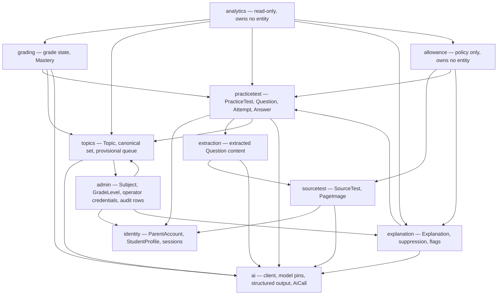
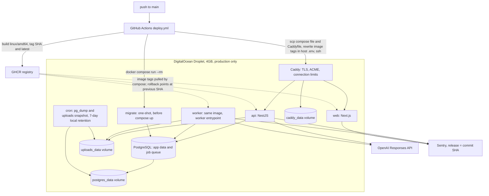
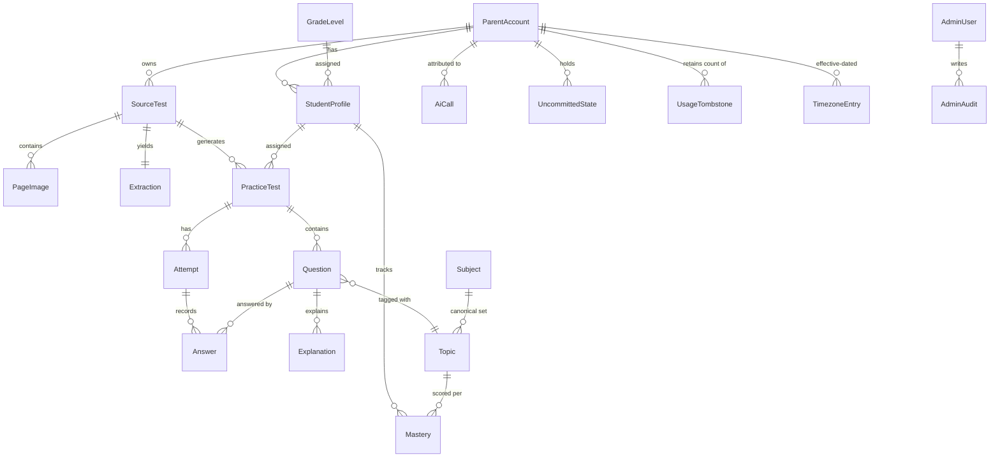

# Architecture Spine — n-test-reviewer

## Design Paradigm

**Modular monolith with a queued worker, decomposed by owned entity cluster.**

One NestJS application; `api` and `worker` are the same image with different entrypoints, sharing one Postgres. Extraction and Generation are queued jobs in that same database, so enqueue and state mutation share a transaction; Grading, Explanation, and the FR-8 legibility check are foreground in-request calls. Each module owns an entity cluster and is the only writer of it; every other module reads through that module's service. `ai` is the single provider boundary; `allowance` and `analytics` are policy/read-only modules that own no entity; `admin` is a separate surface behind a separate credential store.

| Layer | Lives in |
| --- | --- |
| Web (Next.js + MUI) | `apps/web` |
| API + worker (NestJS) | `apps/api/src/<module>` — one directory per owned entity cluster |
| Provider boundary | `apps/api/src/ai` |
| Schema + migrations | `apps/api/prisma` |
| Deploy | `infra/`, `compose.production.yml`, `.github/workflows/deploy.yml` |

## Invariants & Rules

### AD-1 — Inherited stack [ADOPTED]

- **Binds:** all
- **Prevents:** re-litigating platform choices already fixed by PRD §6.2 and the addendum.
- **Rule:**
  - Turborepo + pnpm workspaces; NestJS + Prisma + PostgreSQL on the API; Next.js + React + MUI on the web; Playwright for E2E; Docker Compose in development.
  - JWT auth with argon2 hashing for both the Parent Account password (FR-1) and the Parent PIN (FR-2).
  - Local-filesystem storage for Page Images.
  - OpenAI is a hard dependency with **no provider abstraction layer**; the n-electric client configuration is reused (`@Global()` module, env var `OPENAI_API_KEY`, 30s default timeout, `maxRetries: 2`).

### AD-2 — Inherited product shape [ADOPTED]

- **Binds:** all
- **Prevents:** a module inventing a second actor model, grade state, or counter concept.
- **Rule:**
  - One Parent Account is the only credentialed actor; Student Profiles have no credentials; Student Mode is the device default; Parent View is PIN-gated with a 15-minute silent idle timeout (FR-34); Admin is a separate surface outside any Parent Account.
  - Four AI call classes with distinct cost/latency profiles: Extraction (vision, up to 10 images), Generation, Grading, Explanation — plus FR-8 legibility as a fifth class (AD-29).
  - Four grade states — correct, incorrect, unanswered, ungraded (FR-37) — carried through Attempt storage, the answer key, parent drill-down, and Mastery.
  - Three allowances — Upload, Generation, Explanation — on a calendar month in each Parent Account's own local timezone (FR-31).

### AD-3 — Extraction and Generation are queued jobs

- **Binds:** every caller of Extraction or Generation, the progress surface, all retry and failure handling
- **Prevents:** one unit holding an HTTP connection open while another hands off to a background job — two failure models and two progress mechanisms for the same work.
- **Rule:** a request that triggers Extraction or Generation enqueues it and returns; the job outlives the connection. Progress surfaces read **job status**, never a held connection. No other call class is queued (AD-4).

### AD-4 — Call-class split: queue Extraction and Generation; Grading, Explanation, and FR-8 legibility are foreground

- **Binds:** every AI call site and the surfaces reading their results (FR-8, FR-9, FR-10, FR-19, FR-22, FR-24)
- **Prevents:** an Explanation or a grade built behind a progress screen, or an Extraction run in-request under the 30s client timeout.
- **Rule:**
  - Queued with status polling: Extraction, Generation. Foreground, in-request with an inline loading state and manual retry: Grading, Explanation, FR-8 legibility (AD-29).
  - **Submission blocks on grading** and returns the scored Attempt. Only Fill-in-the-Blank and Short Answer Questions the student **actually answered** are sent; blank Questions consume no model call.
  - `ungraded` is written **only on grading failure**, never as a pending state. There is no fifth grade state; the FR-37 four-state table stands unchanged.
  - FR-22 retry is triggered by **opening the results screen**, by student or parent — no scheduled retry, no job. Retry never blocks rendering: the screen appears immediately with what it can show, and a resolving Question updates in place marked as newly graded.
  - Mastery recompute stays inside the grading transaction (AD-10), which is now the submit request.

### AD-5 — The queue substrate is Postgres-backed

- **Binds:** the job runner, every enqueue site, every progress/status surface
- **Prevents:** half the system treating jobs as transactional with application data while the other half assumes an external broker.
- **Rule:**
  - No new datastore or broker service. Jobs live in the application database.
  - **Enqueueing work and mutating state share one transaction** — required because FR-31 charges on successful production, so "job succeeded, debit did not" must be impossible.
  - Scheduled work (FR-32 90-day Page Image expiry, the FR-35 TTL sweep) runs as **pg-boss schedules** — one scheduling mechanism, never a second ad-hoc scheduler (AD-33).

### AD-6 — Mastery is stored, and grading owns it

- **Binds:** grading, Analytics, the FR-25 override path, any path resolving an ungraded Question (FR-26, FR-27, FR-28, FR-29)
- **Prevents:** Analytics deriving Mastery on read while grading also persists it — two implementations of one formula.
- **Rule:**
  - Analytics reads Mastery and never computes it; no module other than `grading` writes it.
  - **Mastery is recomputed from the window, never incremented.** FR-26 defines it over a rolling window of the 5 most recent qualifying Attempts per Topic (first-Attempt-only, retakes excluded, unanswered and ungraded excluded from the denominator), so the stored value is a function of a moving set.
  - All recompute triggers hit the same code path: grading completing, an ungraded Question resolving on retry, an FR-25 parent override, any new qualifying Attempt.

### AD-7 — Dependency sharp edges are pinned, not discovered

- **Binds:** package manifests, the Prisma client construction, the vision call path
- **Prevents:** day-one breakage from `latest` tags and inherited defaults that do not transfer.
- **Rule:**
  - Pin **both** `prisma` and `@prisma/client` explicitly to 7.10.0 — npm `latest` for the CLI resolves to an 8.0.0 release candidate.
  - `PrismaClient` **must** be constructed with a driver adapter (`@prisma/adapter-pg`); the bare-connection-string constructor is gone in Prisma 7. Generator is `prisma-client`, not `prisma-client-js`.
  - The vision path overrides the inherited 30s client timeout to **180s per request** (AD-33). The SDK retries the whole multi-image request, so the inherited default is 90s of guaranteed failure on a 10-image call.
  - pnpm is pinned via `packageManager` and enforced by Corepack.

### AD-8 — Model family is GPT-5.6, pinned as snapshot ids in configuration

- **Binds:** all four AI call sites and PRD §10 cost attribution
- **Prevents:** call sites independently picking model tiers, and a model retirement becoming a scheduled outage.
- **Rule:**
  - Extraction → `gpt-5.6-sol`. Generation → `gpt-5.6-terra`. Grading and Explanation → `gpt-5.6-luna`.
  - Model ids are **held in configuration**, never inlined in code. **[ASSUMPTION]** sol/terra/luna are currently rolling aliases, not snapshots — the family is real and correctly tiered (GA 2026-07-09), but the actual snapshot ids must be resolved and pinned in configuration before build; until then this Rule is not yet satisfied.

### AD-9 — Structured output via the Responses API

- **Binds:** Extraction, Generation, Grading, Topic normalization — every call whose output is parsed rather than displayed
- **Prevents:** one call class validating against a schema while another trusts a JSON blob.
- **Rule:** use the **Responses API with Structured Outputs** and a JSON schema built from Zod via `zodTextFormat` (`openai/helpers/zod`, SDK 7.8.0). Never Chat Completions `response_format`, never legacy `json_object`.

### AD-10 — Mastery recompute runs inside the transaction of whatever changed a grade

- **Binds:** grading, the ungraded-retry path, the FR-25 override path, Analytics reads
- **Prevents:** a window where a grade exists and Mastery does not yet reflect it, readable by the parent dashboard.
- **Rule:** grading (in the foreground submit request, AD-4), the ungraded-retry resolution, and the parent override each recompute Mastery **before they commit**. No separate recompute job.

### AD-11 — Topic normalization is a three-stage cascade behind one interface

- **Binds:** generation (emits labels), Mastery, Analytics (FR-26a, FR-26, FR-28)
- **Prevents:** two call sites matching Topics by different rules, splitting one concept into two Mastery values.
- **Rule:**
  - One interface: `normalize(label, subjectId) -> canonical Topic id`. Callers see nothing else; any stage may be replaced without touching a caller.
  - Stage 1 — normalize and exact-match (lowercase, strip stopwords, sort tokens).
  - Stage 2 — embed the label with `text-embedding-3-small`, cosine-compare **in application code** against cached canonical vectors for that Subject, threshold ≈ 0.85; vectors stored in an ordinary Prisma column.
  - Stage 3 — one `gpt-5.6-luna` call with the candidate list when cosine falls below threshold; the only stage that may conclude *none of these fit* and mint a new canonical Topic.
  - **pgvector is not adopted.** No `Unsupported(vector(...))` column, no vector index, no `prisma-extension-pgvector`.

### AD-12 — A stage-3 Topic proposal is provisional and queued for the operator

- **Binds:** normalization, the Admin surface (FR-30), Mastery, Analytics
- **Prevents:** the canonical set growing unsupervised, splitting one concept into two Mastery values with no signal.
- **Rule:**
  - The Question receives the proposed Topic immediately so Mastery keeps accruing; the Topic carries a **provisional** flag until an operator confirms, merges, or renames it.
  - A merge re-points every Question tagged with the merged Topic **and** recomputes Mastery for every affected Student Profile, through the same recompute path as every other trigger (AD-10). Built from the start, not retrofitted.

### AD-13 — Mode is carried in the token; the idle clock measures interaction, client-clocked and server-capped

- **Binds:** every API route, the Next.js app, the FR-35 restore path (FR-2, FR-4, FR-34)
- **Prevents:** Student Mode enforced by client routing on one surface and by a server check on another; and an idle rule that a polling screen keeps alive forever while a reading parent is dropped mid-work.
- **Rule:**
  - The token identifies the Parent Account and carries the mode; crossing the Parent PIN mints a token with **Parent View scope**, and every parent-scoped endpoint checks that scope **server-side**.
  - **The client owns the idle clock**, tracking real interaction — pointer, key, scroll, touch — and requesting a refreshed elevation token while the parent is active. **Polling does not touch the clock**; polling is not interaction.
  - The client may only **request** a refresh, never extend a token: the elevation token expires on its own 15-minute window and the server mints any replacement.
  - **Absolute ceiling of 8 hours** on total elevation regardless of activity.
  - The parent-scoped token is held **in memory only** — never persisted to disk, cookie, or web storage.
  - FR-35 restore is gated on presenting a parent-scoped token.

### AD-14 — Allowances are derived, not decremented

- **Binds:** every path gating on allowance (upload, generation enqueue, foreground Explanation) and every path producing a chargeable artifact (FR-31, FR-32, FR-33, FR-39)
- **Prevents:** four counting implementations drifting; a debit forgotten or double-applied; concurrent requests passing a stale clamp; a per-account midnight reset job breaking on DST.
- **Rule:**
  - No counter column and no reset job. Usage for a period is **counted artifacts plus usage tombstones**, scoped to the Parent Account and to the period window computed from the timezone in effect at that period's start (AD-27): Upload = Source Tests created in window; Generation = Practice Tests whose status has ever reached draft; Explanation = Explanation rows generated in window on Free tier.
  - The cap check and the artifact INSERT occur in the **same transaction**; DB serialization enforces the cap, not an application-level clamp.
  - **Deletion erases; an anonymous usage tombstone preserves the count.** Deleting a Student Profile collapses its countable facts into a `UsageTombstone` keyed only by Parent Account, period, call class, and count — everything else is hard-deleted (AD-15). Deletion therefore never refunds, and delete-and-recreate is not a path to unlimited Free tier.
  - A Practice Test charges on **first reaching draft and never again**; the predicate is "has ever reached draft", carried as a durable marker on the row. A generation job producing 1–5 drafts charges per draft that lands; a job failing after three drafts has charged three.
  - A suppressed Explanation (FR-39) still counts as consumed; the free regeneration it entitles carries a flag excluding it from the count — not a second counter.

### AD-15 — Stored bytes are never the authority; a row is, from the first byte

- **Binds:** FR-5 capture and upload, Source Test commit, Extraction, FR-32 retention, FR-33 deletion, FR-35 uncommitted state, any future stored artifact
- **Prevents:** bytes on disk reachable by no rule; a directory scan and a table query disagreeing about what exists.
- **Rule:**
  - A `PageImage` row is INSERTed in state `uploading` **before any byte is written**, and the storage path is **derived from the row's identifier** — never supplied, influenced, or named by the client. This is also the path-traversal control.
  - Every stored artifact has an owner, a created timestamp, and a state. Orphan cleanup, retention, and deletion are **one sweeper over rows** — never a scan over directories.
  - FR-35 uncommitted parent state is a row under the same treatment: owned by the Parent Account, with a state and a TTL, readable only against a parent-scoped token (AD-13).
  - **Deletion erases.** FR-32/FR-33 unlink Page Image files and remove the rows; extracted Question content, Answers, grading rationales, Explanations, Mastery, and the Student Profile itself are hard-deleted. What survives a Student Profile deletion is an anonymous `UsageTombstone` — Parent Account, period, call class, count, and nothing else — which is what keeps the derived count honest without retaining a child's data (AD-14). **Parent Account deletion erases fully, tombstones included.**
  - An abandoned capture consumes nothing: Upload Allowance is charged against the Source Test, not the pages. A swept `uploading` row is deleted outright and leaves no tombstone — it never charged anything.

### AD-16 — One uncommitted-state lifecycle with a single 72-hour TTL

- **Binds:** FR-5 multi-page capture, FR-35 restore, the orphan sweeper, any future uncommitted-work surface
- **Prevents:** a sweeper deleting the exact pages FR-35 promised to give back; two clocks drifting apart.
- **Rule:**
  - FR-35 restorable state and the orphaned-capture sweep are the **same mechanism at two moments**: a row is restorable FR-35 state until its TTL elapses and an orphan after it. Sweeping is expiring FR-35 state.
  - **One TTL, 72 hours from row creation**, applied uniformly to uncommitted state whether or not it carries bytes.
  - The TTL is a floor on retention, not a ceiling on protection: within the window the state stays gated on a parent-scoped token. **Sole exception:** in-progress Attempt state, which is client-owned and student-reachable (AD-26).
  - TTL is measured from row creation and is **not** extended by activity.
  - Expiry deletes the row outright; nothing was charged, so no tombstone is written.

### AD-17 — One writer per entity; the module that writes an entity owns it

- **Binds:** every module, every query, every migration that adds an entity
- **Prevents:** two modules computing the same derived value differently; "who can change this row" becoming unanswerable.
- **Rule:**
  - Every other module reads through the owning module's service and **never through Prisma directly** — no module touches another module's Prisma delegate, for read or write.
  - Decomposition by owned entity cluster: `identity` (Parent Account, Student Profile, sessions) · `sourcetest` (Source Test, Page Image) · `extraction` (extracted Question content on the Source Test) · `practicetest` (Practice Test, Question, Attempt, Answer) · `grading` (grade state, Mastery) · `explanation` (Explanation, suppression state, flags) · `topics` (Topic, canonical set, provisional queue) · `admin` (Subject, GradeLevel, operator credentials, admin audit rows — AD-25) · `allowance` (**owns no entity** — a policy module holding the period-window computation and countable predicates, reading counts across `sourcetest`, `practicetest`, `explanation`) · `analytics` (**owns no entity** — read-only, AD-33).
  - **All AI calls are centralized in one `ai` module**, which owns the OpenAI client, the pinned model snapshots, Responses-API/`zodTextFormat` plumbing, retry and timeout policy, and token/cost accounting. Domain modules call it with a typed request.
  - **Carve-out: prompt text stays in the domain module** that needs it.

### AD-18 — Split credentials: persistent session cookie for identity, in-memory elevation token for Parent View

- **Binds:** every endpoint, every page, the Next.js rendering strategy, the FR-35 restore path
- **Prevents:** the PIN gate degrading to a UI convention that a persisted credential silently defeats.
- **Rule:**
  - **Session credential:** httpOnly, Secure, SameSite=Strict cookie, unreadable by browser JS. Answers *which account*, survives refresh, lets Next.js server-render the shell and student-scoped surfaces.
  - **Elevation credential:** the parent-scoped token of AD-13, held in a React context in memory only, lost on any full page load.
  - **No parent-scoped data is ever server-rendered.** Parent surfaces fetch client-side carrying the elevation token; a server-rendered parent screen is a bug.
  - A refresh or hard navigation drops the parent to the PIN — intended, and why FR-35 exists.
  - The session cookie **alone never satisfies** a parent-scoped endpoint.

### AD-19 — Operational envelope: the n-electric deploy pattern on a DigitalOcean Droplet, driven by GitHub Actions [ADOPTED]

- **Binds:** deployment, environments, TLS, migrations, and the storage assumptions every earlier decision rests on
- **Prevents:** deployment shape being improvised per-service, and a rollback that restores the build that just failed.
- **Rule:**
  - Single hand-provisioned Droplet running Docker Compose. Images built in CI for `linux/amd64`, pushed to GHCR tagged with the commit SHA **and** `latest`.
  - `compose.production.yml` and the Caddyfile are scp'd from the repo on every deploy — **the repo is the source of truth; host copies are disposable.** The release pointer is the image-tag lines in the host `.env`, rewritten in place, after which compose reconciles.
  - Caddy terminates TLS with automatic ACME. State lives in named volumes: `postgres_data`, `caddy_data`, `uploads_data`.
  - **One environment, production only.** No staging tier in v0.
  - **Migrations are a discrete one-shot step** (`docker compose run --rm`) run **before** `compose up`, never on container boot — `api` and `worker` are the same image and would race the migration lock.
  - CI/CD is live: `deploy.yml` on push to `main`, environment `production`, secrets `DROPLET_IP`, `SSH_PRIVATE_KEY`, `GHCR_TOKEN`.
  - **Backups cover uploads, not just Postgres**: the cron snapshots the uploads volume alongside `pg_dump`, same 7-day local retention. Page Images are the only artifact that cannot be regenerated.
  - **Rollback targets the previous SHA tag, never `:latest`.**
  - Droplet sized **4 GB minimum**.
  - Not copied from the reference: committed `terraform.tfstate`/`terraform.tfvars`; a droplet IP hardcoded in the repo; publicly exposed Dozzle with the Docker socket mounted.

### AD-20 — Cost attribution is a table, not a log stream

- **Binds:** PRD §10 per-account cost attribution, every AI call path, any future spend ceiling
- **Prevents:** "which accounts cost the most this month" being unanswerable, and cost history destroyed by log rotation.
- **Rule:**
  - The `ai` module writes an **AiCall row per completed provider call**: Parent Account, call class (Extraction, Generation, Grading, Explanation, Legibility, Topic normalization), pinned model snapshot, input/output token counts, computed cost, latency, correlation id. Owned by `ai` per AD-17; nothing else writes it.
  - **Correlation identifier:** minted at HTTP request entry or job start and threaded through every log line and every AiCall row.
  - **No log line, trace, error report, or AiCall row ever carries** Page Image bytes, extracted Question content, Explanation text, or a child's Answers. Identifiers only.
  - Logging shape: structured JSON to stdout, with Docker log-driver rotation limits declared in the compose file.

### AD-21 — External error tracking via Sentry, with default capture aggressively disabled

- **Binds:** the `api`, `web`, and `worker` containers and the AD-20 logging boundary
- **Prevents:** a queued job dying silently in the worker with no failure notification, and third-party capture of child content.
- **Rule:**
  - All three runtime containers report unhandled exceptions to one Sentry project (free tier), tagged with the release SHA already carried by the deployed image tag and the rollback pointer.
  - **Mandatory configuration, not optional hardening:** `sendDefaultPii: false`; request-body capture off; local-variable capture off; cookie and header capture off; an explicit `beforeSend` denylist.

### AD-22 — The `ai` module boundary is the only test seam for nondeterminism

- **Binds:** all test tiers, CI, and the `ai` module's public interface
- **Prevents:** four nondeterministic paid call paths leaking into the everyday test loop; per-domain mocking strategies drifting apart.
- **Rule:**
  - Every test double swaps that one interface. No domain module may be written in a way that requires knowing whether the provider was real.
  - **Tier 1 — unit/integration:** `ai` faked, against a **real Postgres in a container**. Owns concurrency and lifecycle tests: racing requests against a cap, deletion that must not refund, the 72-hour TTL sweep, elevation-token scope enforcement.
  - **Tier 2 — E2E (Playwright):** full stack, `ai` still faked. Owns flows, the mode gate, and the queue-and-poll progress screen.
  - **Tier 3 — live provider suite:** small, explicitly opt-in, **not in CI** — not on push, not on merge. Detects a retired model snapshot or a structured-output schema that no longer validates.
  - **The fake must be able to fail**, not only succeed: timeouts, provider refusals, schema-invalid responses, and partial success on a multi-draft generation job.

### AD-23 — Abuse defense: a global daily spend ceiling is the backstop, not allowances

- **Binds:** all unauthenticated endpoints and every AI call path
- **Prevents:** free account creation converting a per-account cap into unlimited paid provider calls.
- **Rule:**
  - **IP-based rate limits on unauthenticated endpoints** via `@nestjs/throttler` — tight on signup, looser on login. In-process storage is valid only while the deployment is single-host; if that changes it moves to shared storage. Login needs this independently: argon2 is deliberately expensive, so a login flood is a CPU DoS.
  - **A global daily spend ceiling enforced against the AiCall table** — total across all accounts, not per account. Crossing the configured limit refuses new AI work and fires an alert.
  - Connection-level limits sit at Caddy.
  - Deliberately not in v0: email-verification gating, CAPTCHA, per-IP account-creation quotas beyond the throttle.

### AD-24 — Generation is incremental; partial success is a real user-visible outcome

- **Binds:** the Generation job, the generation-progress surface, allowance charging (FR-11, FR-31)
- **Prevents:** a completed draft being discarded on a later failure of the same job, and a partial result with no state to render.
- **Rule:**
  - Each draft is **committed as it lands** and charges one Generation Allowance unit (AD-14). Landed drafts are never discarded on subsequent failure of the same job.
  - A job producing 3 of 5 requested Practice Tests reports as **partially complete**: the parent receives 3 and is charged 3.
  - A job in which **nothing landed charges nothing** and reports as failed. EXPERIENCE.md's "a failed generation costs nothing" is retained, scoped to this case.
  - Source-side follow-up owned by UX/PM, not architecture: EXPERIENCE.md needs a partial-completion state and copy line; FR-31's charging language must read per-artifact, not per-request.

### AD-25 — Admin is a separate module with a separate credential store

- **Binds:** FR-30, FR-30a, the provisional-Topic operator queue, the flagged-Explanation queue
- **Prevents:** an operator credential doubling as a family credential, and admin isolation depending on a check someone must remember to add.
- **Rule:**
  - Operator identities are **not** Parent Accounts: a distinct table, a distinct login, its own API route namespace, and its own Next.js route group. An operator credential cannot satisfy a parent-scoped guard and a parent credential cannot satisfy an admin guard.
  - `admin` **owns Subject and GradeLevel**. Account Tier assignment writes `ParentAccount` **through `identity`'s service**; the flagged-Explanation queue reads through `explanation`'s service; the provisional-Topic queue reads through `topics` (AD-17).
  - v0 thinness: **one operator account, seeded out-of-band**, no roles, no invitations, no self-service signup.
  - **An audit row for every admin write** — tier changes, taxonomy edits, flagged-queue dispositions. FR-30a defers authentication depth, not accountability.
  - Revisit before any third-party operator exists.

### AD-26 — In-progress Attempt state is client-owned, and is the one uncommitted-state mechanism that is not parent-gated

- **Binds:** the Attempt surface, submission, the timer, grade-state assignment (FR-15, FR-16..FR-20, FR-36, FR-37)
- **Prevents:** the parent-gated 72-hour mechanism (AD-16) locking a student out of their own in-progress test.
- **Rule:**
  - Answers within an open Attempt are held in **client-side persistent storage keyed to the Attempt**, surviving refresh and backgrounding with no network round trip. This is the only place student work lives outside the database, and it is what makes FR-36's offline answering and navigation work.
  - **Submission requires the network and is never retried silently.** The student is told, the Attempt stays open with every answer intact, and they submit again themselves.
  - **Timer authority is the server, evaluated at submit.** The Attempt carries a server-issued started-at and duration; the client renders a countdown but never decides expiry. A timer that expires offline auto-submits **on reconnect** and is graded **against the moment of expiry**, not the moment of reconnect — expiry decides incorrect versus unanswered per FR-37, which propagates into Mastery.
  - Client-held answers are cleared on successful submission.

### AD-27 — The account timezone is effective-dated; changing it never re-slices a running period

- **Binds:** every period-window computation in `allowance`, the FR-30a admin consumption view (FR-31)
- **Prevents:** a timezone change moving counts, shortening a period, or making a past reset date retroactively wrong.
- **Rule:**
  - The Parent Account holds a **timezone history of effective-dated entries**, not a single mutable field.
  - The window for any period is computed from the zone **in effect at that period's start**; a change takes effect from the **next** period boundary.
  - The FR-30a admin view reads the same history, so admin and parent views can never disagree.

### AD-28 — Image ingest is owned by `sourcetest` and is mandatory before any vision call

- **Binds:** FR-5 capture and upload, Extraction, the FR-8 legibility check
- **Prevents:** an iPhone-default HEIC reaching a vision call that cannot read it, and a rotated page degrading Extraction.
- **Rule:**
  - **`file-type` byte-sniffing** against an `ALLOWED_MIMES` set (jpeg, png, webp, heic, heif, avif) decides the format. The client-declared MIME type is never trusted; this is also the upload-safety control.
  - `sharp(buffer).rotate()` honors EXIF orientation, then re-encodes to **JPEG q85**. Carry the n-electric fix around `meta.autoOrient` width handling.
  - Normalization happens **on ingest**, before the `PageImage` row leaves `uploading`, so no downstream consumer ever sees a format the model cannot read.

### AD-29 — FR-8 legibility is the fifth AI call class

- **Binds:** the `ai` module's call-class enumeration, `sourcetest`, cost attribution (FR-8, FR-10, FR-31)
- **Prevents:** a batch vision call with no model pin, no timeout, and no cost row.
- **Rule:**
  - A **distinct call class** with its own pinned model snapshot and its own AiCall rows, so its cost attributes separately from Extraction.
  - **Foreground, not queued** — it gates whether the parent is asked to retake a page while the physical paper is still in hand.
  - Its output feeds the same per-field confidence signal as Extraction (AD-30).
  - It **charges no allowance**: FR-31 charges on successful production, and a legibility check produces nothing.

### AD-30 — Model output carries per-field confidence and passes deterministic post-hoc validation

- **Binds:** every AI schema and every AI payload consumer (FR-8, FR-9, FR-9a, FR-11)
- **Prevents:** a schema-valid payload whose content is nonsense being trusted because it parsed.
- **Rule:**
  - Every Extraction schema field carries a self-assessed confidence of **low / medium / high**, and prompts instruct the model to return `null` for any field it cannot read confidently rather than guess — the mechanism behind FR-9's uninterpretable-not-hallucinated rule. Aggregate low confidence across a page is the signal behind FR-8 and FR-9a.
  - **Deterministic post-hoc validation runs in code on every AI payload after schema validation**, downgrading confidence or rejecting outright. Canonical case: a generated Multiple Choice Question whose correct answer is not among its own options is malformed and must be caught in code.
  - Validation failure is a **content** fault, distinct from a transport fault, and routes per AD-31.

### AD-31 — AI failures split into client-fault and upstream-fault, and degrade differently

- **Binds:** every AI call path, the job retry policy, the FR-10 retake prompt, FR-22 (FR-9, FR-10, FR-11, FR-22)
- **Prevents:** a retry policy re-enqueuing an unusable photograph forever, burning spend on input that can never succeed.
- **Rule:**
  - **Client fault (BadRequest class):** an unreadable or unusable *input*. Terminal, never retried, surfaced to the parent as a retake prompt per FR-10.
  - **Upstream fault (BadGateway class):** provider timeout, rate limit, refusal, or outage. Retried with backoff; on exhaustion surfaced as a transient failure the user can retry themselves.
  - A schema-validation or post-hoc-validation failure is an **upstream** fault — the input was fine and the model misbehaved.
  - Grading exhaustion writes `ungraded` (FR-22, AD-4). Generation exhaustion leaves the job failed with whatever drafts already landed committed and charged (AD-24).

### AD-32 — The presentation tier is governed, not dropped

- **Binds:** every user-facing surface, the DESIGN.md token set, the `ai` module's Question and Explanation schemas, every student-scoped endpoint (PRD §10.1, §6.1)
- **Prevents:** cross-cutting constraints expressed as tone or copy being dropped because they are not features.
- **Rule:**
  - **Accessibility is a build constraint, not a review step:** WCAG 2.1 AA, an ARIA-live timer, a keyboard-reachable question map, and DESIGN.md's contrast floors including SC 1.4.11 for the divider tokens that are the sole boundary of every control. PRD §10.1's SC 2.2.1 essential-timing exception argument is retained as written and must not be re-derived.
  - **Fractions render typographically, and what is structured is the emission behind them** — a **schema** constraint on the Question and Explanation schemas, not a CSS concern, because a spoken alternative cannot be recovered from a glyph.
  - **Dark mode is scope, not polish:** every DESIGN.md token has both values and no surface hardcodes a color. The inverted camera-chrome tokens are a **declared exception** carrying `deliberateDuplicate` markers that forbid aliasing them back to the primary palette; light primary measures 2.52:1 on the inverted ground and "fixing it back" is forbidden.
  - **Copy is a parameterized layer:** no result string is a fixed literal, and person differs by surface — **second** person to the student, **third** person to the parent. A hardcoded user-facing string is a defect.
  - **Child-facing exposure rule:** no allowance counter, cost figure, tier label, model name, or AI grading rationale is ever reachable from a student-scoped endpoint. The API-surface twin of AD-20's logging rule.

### AD-33 — Residual bindings and pins

- **Binds:** scheduling, the Explanation cache, PIN lockout, FR-35 restore, timer configuration, `analytics`, the vision call path (FR-2, FR-15, FR-24, FR-32, FR-35, FR-39)
- **Prevents:** each of these being decided independently at its call site, where the wrong answer is invisible until it is expensive.
- **Rule:**
  - **Scheduling:** FR-32's 90-day Page Image expiry and the 72-hour uncommitted-state sweep run as **pg-boss schedules**, not `@nestjs/schedule` — one mechanism, and the only option that does not fire duplicate work if a second process is ever started.
  - **FR-24 Explanation cache key includes the Student Profile**, so an Explanation suppressed under FR-39 for one child can never be served to that child from cache, and a free regeneration is a distinct entry rather than an overwrite.
  - **FR-2 PIN lockout counter is persisted server-side** against the Parent Account, never client-held — a client-held counter is cleared by the same refresh the mode gate already expects.
  - **FR-35 cross-profile rejection:** retained uncommitted parent state is keyed to the Parent Account **and** the Student Profile it was created under; restoring it into a different profile is refused, not silently rebound.
  - **FR-15 timer immutability:** a Practice Test's timer configuration is written once at generation and is immutable thereafter — a timer changed mid-life retroactively changes how expiry graded past Attempts.
  - **`analytics` is an owns-nothing read-only consumer**, with explicit read edges to `practicetest`, `grading`, `explanation`, and `allowance`.
  - **Vision per-request timeout is 180 seconds** — a timeout shorter than the provider's own worst case converts a slow success into a retry that pays twice.

### AD-34 — Two policy commitments with a mechanism

- **Binds:** the signup endpoint, the `admin` module, the deployment checklist (PRD §5.2)
- **Prevents:** an open signup path in front of a paid provider key, and a privacy commitment that no code can assert.
- **Rule:**
  - **Invitation-only registration at launch.** Registration is closed by default and opened only by an invitation code checked **at the signup endpoint, not in the UI**. The code set is operator-managed through `admin`. This is the only thing between the AD-23 global spend ceiling and the open internet.
  - **Provider no-training terms:** the account and API configuration used for every call must have training-on-submitted-data disabled. This is a **deployment precondition**, not a code concern — recorded as a launch checklist item with a named owner, and a change to provider terms is a revisit trigger.

## Upstream Supersessions

Declared so a builder working from the upstream documents does not walk into a superseded instruction.

- The addendum's hedge — "keep the four call classes in four distinct modules rather than inlining OpenAI calls at their use sites" — is **superseded by the single `ai` module** (AD-17). This is not the vendor-neutral provider abstraction the addendum rejected; `ai` is OpenAI-specific by construction. The hedge's stated purpose was localizing a refactor, which centralization serves better.
- The addendum's statement that Generation, Grading, and Explanation follow n-electric's `chat.completions` + `response_format` strict-schema pattern is **forbidden** here, in favor of the Responses API with `zodTextFormat` (AD-9). A builder templating from n-electric would otherwise land on a forbidden API.
- Both supersessions should be pushed back into the addendum so upstream and this spine do not silently diverge.

## Consistency Conventions

| Concern | Convention |
| --- | --- |
| Naming (modules, entities) | One lowercase single-word NestJS module per owned entity cluster (`identity`, `sourcetest`, `extraction`, `practicetest`, `grading`, `explanation`, `topics`, `admin`, `allowance`, `analytics`, `ai`); entities PascalCase singular, matching the PRD glossary term. |
| Cross-module access | Through the owning module's injected service only; never another module's Prisma delegate (AD-17). |
| AI calls | Through the `ai` module with a typed request and a Zod schema; prompt text lives in the calling domain module. |
| Model ids | Pinned snapshot ids in configuration, never in code (AD-8). |
| Time & periods | Period windows computed from the zone in effect at the period's start, read from the account's effective-dated timezone history; no per-account reset scheduler (AD-14, AD-27). |
| Job/state mutation | Enqueue and mutate in one transaction (AD-5); Mastery recompute commits with the grade change (AD-10). |
| Deletion | Erase the rows and unlink the files; a Student Profile deletion leaves only an anonymous `UsageTombstone`, and a Parent Account deletion leaves nothing (AD-14, AD-15). Uncommitted rows are removed outright with no tombstone (AD-16). |
| Scheduling | pg-boss schedules only; never `@nestjs/schedule` (AD-33). |
| User-facing strings | Parameterized, never literal; second person to the student, third to the parent (AD-32). |
| Logging & correlation | Structured JSON to stdout, Docker rotation limits in compose; one correlation id per request/job threaded through logs and AiCall rows; never any child content (AD-20). |
| Config & secrets | `OPENAI_API_KEY` (name shared with n-electric); deploy secrets `DROPLET_IP`, `SSH_PRIVATE_KEY`, `GHCR_TOKEN`. |
| Auth | Session = httpOnly/Secure/SameSite=Strict cookie; elevation = in-memory parent-scoped token; scope checked server-side on every parent endpoint (AD-13, AD-18). |

## Stack

| Name | Version |
| --- | --- |
| Node | >= 24 (Krypton, Active LTS) |
| Turborepo | 2.10.12 |
| pnpm | 11.25.0 (pinned via `packageManager`) |
| NestJS (core packages) | 12.0.1 |
| prisma (CLI) | 7.10.0 (pinned exactly, never with `^` — the CLI's `latest` tag is `8.0.0-rc.12`, ahead of the client) |
| @prisma/client | 7.10.0 |
| @prisma/adapter-pg | matching @prisma/client 7.10.0 |
| PostgreSQL | 18.6, image `postgres:18.6-alpine`, patch-pinned since the compose file is scp'd verbatim on every deploy (19 is still Beta) |
| TypeScript | 6.0.3 — not 7.0.2: TS 7.0 ships with no programmatic compiler API until 7.1 (still `7.1.0-dev`, targeted ~Oct 2026), `nest build` needs that API, and `typescript-eslint`'s peer range hard-caps below 6.1.0. Revisit when 7.1 GA ships the programmatic API. |
| zod | 4.5.4 (pinned — the `zodTextFormat` structured-output path depends on it and the SDK peer accepts v3 or v4) |
| pg-boss | 12.29.0 (queue **and** schedules, AD-33) |
| Next.js | 16.3.4 |
| React | 19.2.8 |
| @mui/material | 9.4.0 |
| @emotion/react, @emotion/styled | required MUI peers, added to the manifest explicitly |
| openai (Node SDK) | 7.8.0 |
| argon2 | 0.45.1 |
| sharp | 0.35.4 — image ingest: EXIF rotate + JPEG q85 re-encode (AD-28) |
| file-type | 22.0.2 — byte-sniffing MIME detection on upload (AD-28) |
| Playwright | 1.62.1 |
| OpenAI models | family GPT-5.6, GA 2026-07-09; sol/terra/luna are **rolling aliases, not snapshots** — [ASSUMPTION] resolve and pin the actual snapshot ids in configuration before build, the spine must not claim snapshots are pinned until that's done. Extraction → sol. Generation → terra. Grading, Explanation, Topic stage 3 → luna. Topic stage 2 → `text-embedding-3-small` (confirmed current). Legibility carries its own snapshot pin (AD-29). |
| Caddy | 2.11.4, automatic ACME, reverse proxy |
| Sentry SDKs | 10.73.0, free tier — 5,000 errors/month, one seat, 30-day retention across all three containers; a crash-looping worker can exhaust the monthly quota, so a client-side rate limit on error reporting is required (AD-21) |

## Structural Seed

### Module dependency direction

Arrows point at the module being read from. No arrow may be reversed without moving entity ownership.



`topics --> admin` and `admin --> topics` are both real and not a reversal: `topics` reads `Subject` to scope its canonical set (AD-11), `admin` reads the provisional-Topic queue to dispose of it (AD-12, AD-25).

### Deployment and operational envelope



### Core entities



### Source tree

```text
n-test-reviewer/
  apps/
    api/            # NestJS; api and worker entrypoints from one image
      prisma/       # schema + migrations (generator prisma-client, adapter-pg)
      src/
        identity/ sourcetest/ extraction/ practicetest/
        grading/ explanation/ topics/ admin/
        analytics/   # read-only, owns no entity
        allowance/   # policy module, owns no entity
        ai/          # OpenAI client, model pins, structured output, AiCall
    web/            # Next.js + MUI
  packages/         # shared types/config
  infra/            # Caddyfile, terraform (state not committed)
  compose.production.yml
  .github/workflows/deploy.yml
```

## Capability → Architecture Map

| Capability / Area | Lives in | Governed by |
| --- | --- | --- |
| §4.1 Accounts, profiles, mode switching (FR-1..FR-4, FR-34, FR-35) | `identity`, web auth shell | AD-1, AD-2, AD-13, AD-16, AD-18, AD-33 |
| §4.2 Source Test upload and legibility (FR-5..FR-8) | `sourcetest`, `ai` | AD-14, AD-15, AD-16, AD-28, AD-29, AD-30, AD-31 |
| §4.3 Extraction and generation (FR-9, FR-9a, FR-10, FR-11) | `extraction`, `practicetest`, `ai` | AD-3, AD-4, AD-5, AD-7, AD-8, AD-9, AD-14, AD-24, AD-30, AD-31 |
| §4.4 Parent review and release (FR-12..FR-15) | `practicetest`, web Parent View | AD-14, AD-18, AD-33 |
| §4.5 Taking a Practice Test (FR-16..FR-20, FR-36) | `practicetest`, web Attempt surface | AD-17, AD-18, AD-26, AD-32 |
| §4.6 Grading, reveal, Explanations (FR-21..FR-25, FR-24a, FR-37..FR-39) | `grading`, `explanation`, `ai` | AD-4, AD-6, AD-9, AD-10, AD-14, AD-31, AD-33 |
| §4.7 Analytics and Mastery (FR-26, FR-26a, FR-27..FR-29) | `analytics`, `grading`, `topics` | AD-6, AD-10, AD-11, AD-12, AD-17, AD-33 |
| §4.8 Admin configuration (FR-30, FR-30a) | `admin`, reading `identity`, `topics`, `explanation` | AD-2, AD-12, AD-25, AD-27, AD-34 |
| §4.9 Retention and deletion (FR-32, FR-33) | `sourcetest`, the row sweeper | AD-5, AD-15, AD-16, AD-19, AD-33 |
| §4.10 Tiers and allowance enforcement (FR-31) | `allowance` | AD-14, AD-23, AD-24, AD-27 |
| §10 Observability and cost attribution | `ai` | AD-20, AD-21, AD-29 |
| §10.1 / §6.1 Presentation: accessibility, dark mode, copy, child-facing exposure | web, DESIGN.md tokens, `ai` schemas | AD-32 |
| Abuse and spend defense | edge + `ai` + signup | AD-19, AD-23, AD-34 |

## Deferred

- **Offsite backup of uploaded Page Images.** v0 backs the uploads volume to local droplet disk only, on the same cron and 7-day retention as `pg_dump`. Survives a bad deploy, migration, or volume removal — **not** loss of the droplet. Accepted risk for v0. Planned resolution: push the local snapshot to Cloudflare R2 as one appended step in the backup script. **Revisit before the first real family's data lands, or at the first paying account, whichever comes first.**
- **De-duplication of Admin content-quality queue entries for one Explanation** (parent flag FR-24a vs confirmed student flag FR-38 reaching FR-30a by two routes) — the queue's identity model is unresolved.
